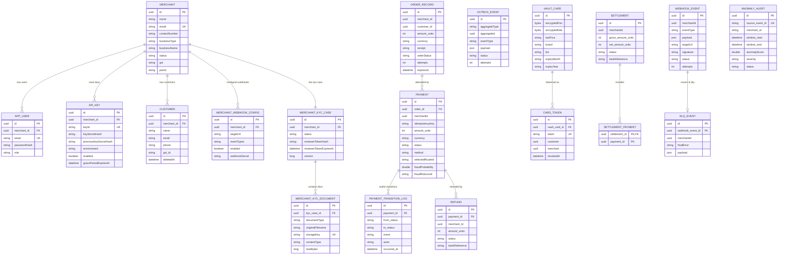

# Database Architecture (ER Diagrams)

```mermaid
erDiagram
    %% merchant-service MySQL Database
    MERCHANT {
        uuid id PK
        string name
        string email UK
        string contactNumber
        string businessType
        string businessName
        string status
        string gst
        string panId
    }
    APP_USER {
        uuid id PK
        uuid merchant_id FK
        string email UK
        string passwordHash
        string role
    }
    API_KEY {
        uuid id PK
        uuid merchant_id FK
        string keyId UK
        string keySecretHash
        string previousKeySecretHash
        string environment
        boolean enabled
        datetime gracePeriodExpiresAt
    }
    CUSTOMER {
        uuid id PK
        uuid merchant_id FK
        string name
        string email
        string phone
        string gst_id
        datetime deletedAt
    }
    MERCHANT_WEBHOOK_CONFIG {
        uuid id PK
        uuid merchant_id FK
        string targetUrl
        string eventTypes
        boolean enabled
        string webhookSecret
    }
    MERCHANT_KYC_CASE {
        uuid id PK
        uuid merchant_id FK
        string status
        string reviewerTokenHash
        datetime reviewerTokenExpiresAt
        long version
    }
    MERCHANT_KYC_DOCUMENT {
        uuid id PK
        uuid kyc_case_id FK
        string documentType
        string originalFilename
        string storageKey UK
        string contentType
        long sizeBytes
    }

    MERCHANT ||--o{ APP_USER : "has users"
    MERCHANT ||--o{ API_KEY : "owns keys"
    MERCHANT ||--o{ CUSTOMER : "has customers"
    MERCHANT ||--o{ MERCHANT_WEBHOOK_CONFIG : "configures webhooks"
    MERCHANT ||--|| MERCHANT_KYC_CASE : "has kyc case"
    MERCHANT_KYC_CASE ||--o{ MERCHANT_KYC_DOCUMENT : "contains docs"

    %% payment-service MySQL Database
    ORDER_RECORD {
        uuid id PK
        uuid merchant_id
        uuid customer_id
        int amount_units
        string currency
        string receipt
        string orderStatus
        int attempts
        datetime expiresAt
    }
    PAYMENT {
        uuid id PK
        uuid order_id FK
        uuid merchantId
        string idempotencyKey
        int amount_units
        string currency
        string status
        string method
        string selectedRouteId
        double fraudProbability
        string fraudRiskLevel
    }
    PAYMENT_TRANSITION_LOG {
        uuid id PK
        uuid payment_id FK
        string from_status
        string to_status
        string event
        string actor
        datetime occurred_at
    }
    REFUND {
        uuid id PK
        uuid payment_id FK
        uuid merchant_Id
        int amount_units
        string status
        string bankReference
    }
    OUTBOX_EVENT {
        uuid id PK
        string aggregateType
        uuid aggregateId
        string eventType
        json payload
        string status
        int attempts
    }

    ORDER_RECORD ||--o{ PAYMENT : "attempted by"
    PAYMENT ||--o{ PAYMENT_TRANSITION_LOG : "audits transitions"
    PAYMENT ||--o{ REFUND : "refunded by"

    %% vault-service MySQL Database
    VAULT_CARD {
        uuid id PK
        bytes encryptedPan
        bytes encryptedDek
        string lastFour
        string brand
        string bin
        string expiryMonth
        string expiryYear
    }
    CARD_TOKEN {
        uuid id PK
        uuid vault_card_id FK
        string token UK
        uuid customer
        uuid merchant
        datetime revokedAt
    }

    VAULT_CARD ||--o{ CARD_TOKEN : "tokenized as"

    %% operations-service MySQL Database
    SETTLEMENT {
        uuid id PK
        uuid merchantId
        int gross_amount_units
        int net_amount_units
        string status
        string bankReference
    }
    SETTLEMENT_PAYMENT {
        uuid settlement_id PK,FK
        uuid payment_id PK
    }
    WEBHOOK_EVENT {
        uuid id PK
        uuid merchantId
        string eventType
        json payload
        string targetUrl
        string signature
        string status
        int attempts
    }
    DLQ_EVENT {
        uuid id PK
        uuid webhook_event_id FK
        uuid merchantId
        string finalError
        json payload
    }
    ANOMALY_ALERT {
        uuid id PK
        string source_event_id UK
        string merchant_id
        datetime window_start
        datetime window_end
        double anomalyScore
        string severity
        string status
    }

    SETTLEMENT ||--o{ SETTLEMENT_PAYMENT : "includes"
    WEBHOOK_EVENT ||--o| DLQ_EVENT : "moves to dlq"
```
