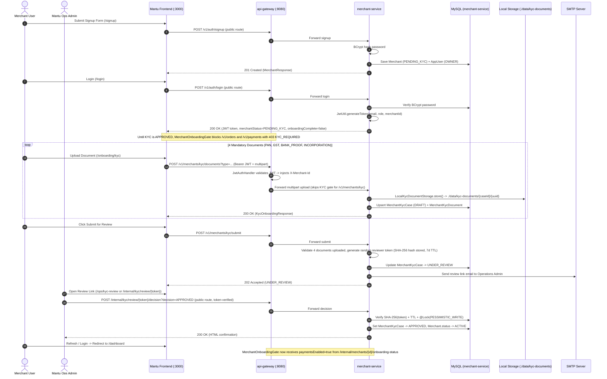

# Merchant Onboarding and KYC Sequence

```mermaid
sequenceDiagram
    autonumber
    actor Merchant as Merchant User
    actor OpsAdmin as Mantu Ops Admin
    participant UI as Mantu Frontend (:3000)
    participant GW as api-gateway (:8080)
    participant MS as merchant-service
    participant DB as MySQL (merchant-service)
    participant FS as Local Storage (./data/kyc-documents)
    participant Mail as SMTP Server

    Merchant->>UI: Submit Signup Form (/signup)
    UI->>GW: POST /v1/auth/signup (public route)
    GW->>MS: Forward signup
    MS->>MS: BCrypt hash password
    MS->>DB: Save Merchant (PENDING_KYC) + AppUser (OWNER)
    MS-->>UI: 201 Created (MerchantResponse)

    Merchant->>UI: Login (/login)
    UI->>GW: POST /v1/auth/login (public route)
    GW->>MS: Forward login
    MS->>DB: Verify BCrypt password
    MS->>MS: JwtUtil.generateToken(email, role, merchantId)
    MS-->>UI: 200 OK (JWT token, merchantStatus=PENDING_KYC, onboardingComplete=false)

    Note over UI,GW: Until KYC is APPROVED, MerchantOnboardingGate blocks /v1/orders and /v1/payments with 403 KYC_REQUIRED

    loop 4 Mandatory Documents (PAN, GST, BANK_PROOF, INCORPORATION)
        Merchant->>UI: Upload Document (/onboarding/kyc)
        UI->>GW: POST /v1/merchants/kyc/documents?type=... (Bearer JWT + multipart)
        GW->>GW: JwtAuthHandler validates JWT -> injects X-Merchant-Id
        GW->>MS: Forward multipart upload (skips KYC gate for /v1/merchants/kyc)
        MS->>FS: LocalKycDocumentStorage.store() -> ./data/kyc-documents/{caseId}/{uuid}
        MS->>DB: Upsert MerchantKycCase (DRAFT) + MerchantKycDocument
        MS-->>UI: 200 OK (KycOnboardingResponse)
    end

    Merchant->>UI: Click Submit for Review
    UI->>GW: POST /v1/merchants/kyc/submit
    GW->>MS: Forward submit
    MS->>MS: Validate 4 documents uploaded, generate random reviewer token (SHA-256 hash stored, 7d TTL)
    MS->>DB: Update MerchantKycCase -> UNDER_REVIEW
    MS->>Mail: Send review link email to Operations Admin
    MS-->>UI: 202 Accepted (UNDER_REVIEW)

    OpsAdmin->>UI: Open Review Link (/ops/kyc-review or /internal/kyc/review/{token})
    OpsAdmin->>GW: POST /internal/kyc/review/{token}/decision?decision=APPROVED (public route, token-verified)
    GW->>MS: Forward decision
    MS->>DB: Verify SHA-256(token) + TTL + @Lock(PESSIMISTIC_WRITE)
    MS->>DB: Set MerchantKycCase -> APPROVED, Merchant.status -> ACTIVE
    MS-->>OpsAdmin: 200 OK (HTML confirmation)

    Merchant->>UI: Refresh / Login -> Redirect to /dashboard
    Note over GW,MS: MerchantOnboardingGate now receives paymentsEnabled=true from /internal/merchants/{id}/onboarding-status
```
