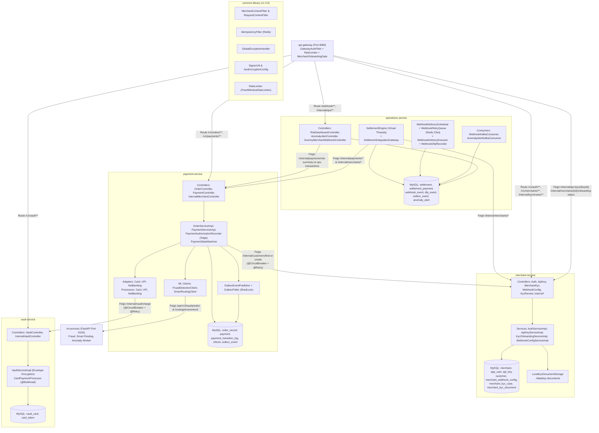

# Microservices Architecture & Inter-Service Communication

```mermaid
flowchart TB
    GW["api-gateway (Port 8080)<br/>GatewayAuthFilter + RateLimiter + MerchantOnboardingGate"]

    subgraph Common["common-library (v1.0.0)"]
        CL1["MerchantContextFilter & RequestContextFilter"]
        CL2["IdempotencyFilter (Redis)"]
        CL3["GlobalExceptionHandler"]
        CL4["SignerUtil & AesEncryptionConfig"]
        CL5["RateLimiter (FixedWindowRateLimiter)"]
    end

    subgraph MS["merchant-service"]
        MS_C["Controllers: Auth, ApiKey, MerchantKyc,<br/>WebhookConfig, KycReview, Internal*"]
        MS_S["Services: AuthServiceImpl, ApiKeyServiceImpl,<br/>KycOnboardingServiceImpl, WebhookConfigServiceImpl"]
        MS_DB[("MySQL: merchant, app_user, api_key,<br/>customer, merchant_webhook_config,<br/>merchant_kyc_case, merchant_kyc_document")]
        MS_FS["LocalKycDocumentStorage<br/>./data/kyc-documents"]
        MS_C --> MS_S --> MS_DB
        MS_S --> MS_FS
    end

    subgraph PS["payment-service"]
        PS_C["Controllers: OrderController, PaymentController,<br/>InternalMerchantController"]
        PS_S["OrderServiceImpl, PaymentServiceImpl,<br/>PaymentAuthorizationRecorder (Saga),<br/>PaymentStateMachine"]
        PS_A["Adapters: Card, UPI, NetBanking<br/>Processors: Card, UPI, NetBanking"]
        PS_ML["ML Clients: FraudDetectionClient,<br/>SmartRoutingClient"]
        PS_OB["OutboxEventPublisher + OutboxPoller (ShedLock)"]
        PS_DB[("MySQL: order_record, payment,<br/>payment_transition_log, refund, outbox_event")]
        PS_C --> PS_S --> PS_A
        PS_S --> PS_ML
        PS_S --> PS_OB --> PS_DB
        PS_S --> PS_DB
    end

    subgraph VS["vault-service"]
        VS_C["Controllers: VaultController, InternalVaultController"]
        VS_S["VaultServiceImpl (Envelope Encryption)<br/>CardPaymentProcessor (@Bulkhead)"]
        VS_DB[("MySQL: vault_card, card_token")]
        VS_C --> VS_S --> VS_DB
    end

    subgraph OS["operations-service"]
        OS_C["Controllers: RiskDashboardController,<br/>AnomalyAlertController, DummyMerchantWebhookController"]
        OS_K["Consumers: WebhookKafkaConsumer,<br/>AnomalyAlertKafkaConsumer"]
        OS_W["WebhookDeliverySchedular + WebhookRetryQueue (Redis ZSet)<br/>+ WebhookDeliveryExecutor + WebhookDlqRecorder"]
        OS_ST["SettlementEngine (Virtual Threads)<br/>+ SettlementIntegrationGateway"]
        OS_DB[("MySQL: settlement, settlement_payment,<br/>webhook_event, dlq_event, outbox_event, anomaly_alert")]
        OS_C --> OS_DB
        OS_K --> OS_DB
        OS_W --> OS_DB
        OS_ST --> OS_DB
    end

    MLS["ml-services (FastAPI Port 8100)<br/>Fraud, Smart Routing, Anomaly Worker"]

    GW -- "Feign /internal/api-keys/{keyId}<br/>/internal/merchants/{id}/onboarding-status" --> MS_C
    GW -- "Route /v1/auth/**, /v1/merchants/**, /internal/kyc/review/**" --> MS_C
    GW -- "Route /v1/orders/**, /v1/payments/**" --> PS_C
    GW -- "Route /v1/vault/**" --> VS_C
    GW -- "Route /webhook/**, /internal/ops/**" --> OS_C

    PS_S -- "Feign /internal/customers/find-or-create<br/>(@CircuitBreaker + @Retry)" --> MS_C
    PS_A -- "Feign /internal/vault/charge<br/>(@CircuitBreaker + @Retry)" --> VS_C
    PS_ML -- "Feign /api/v1/fraud/predict & /routing/recommend" --> MLS
    OS_ST -- "Feign /internal/payments/* & /internal/merchants/*" --> PS_C
    OS_ST -- "Feign /internal/merchants/*" --> MS_C
    OS_C -- "Feign /internal/payments/risk-summary & ops-transactions" --> PS_C
```
