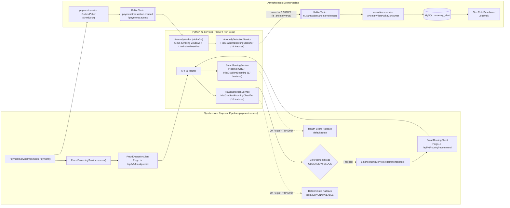

# Machine Learning Integration Architecture

```mermaid
flowchart LR
    subgraph PaymentFlow["Synchronous Payment Pipeline (payment-service)"]
        PI["PaymentServiceImpl.initiatePayment()"]
        FS["FraudScreeningService.screen()"]
        SR["SmartRoutingService.recommendRoute()"]
        FC["FraudDetectionClient<br/>Feign -> /api/v1/fraud/predict"]
        RC["SmartRoutingClient<br/>Feign -> /api/v1/routing/recommend"]
        FB1["Deterministic Fallback<br/>riskLevel=UNAVAILABLE"]
        FB2["Health Score Fallback<br/>default route"]
        ENF{"Enforcement Mode<br/>OBSERVE vs BLOCK"}
    end

    subgraph MLService["Python ml-services (FastAPI Port 8100)"]
        API["API v1 Router"]
        FDS["FraudDetectionService<br/>HistGradientBoostingClassifier (10 features)"]
        SRS["SmartRoutingService<br/>Pipeline: OHE + HistGradientBoosting (17 features)"]
        ADS["AnomalyDetectionService<br/>HistGradientBoostingClassifier (25 features)"]
        AW["AnomalyWorker (aiokafka)<br/>5-min tumbling windows + 12-window baseline"]
    end

    subgraph AsyncFlow["Asynchronous Event Pipeline"]
        OB["payment-service OutboxPoller<br/>(ShedLock)"]
        K1[["Kafka Topic:<br/>payment.transaction.created / payments.events"]]
        K2[["Kafka Topic:<br/>ml.transaction.anomaly.detected"]]
        AC["operations-service<br/>AnomalyAlertKafkaConsumer"]
        ADB[("MySQL: anomaly_alert")]
        OPS["Ops Risk Dashboard<br/>/ops/risk"]
    end

    PI --> FS --> FC --> API --> FDS
    FDS -. "On Feign/HTTP Error" .-> FB1
    FDS --> ENF
    ENF -- "Proceed" --> SR --> RC --> API --> SRS
    SRS -. "On Feign/HTTP Error" .-> FB2

    PI --> OB --> K1
    K1 --> AW --> ADS
    ADS -- "score >= 0.902627 (is_anomaly=true)" --> K2
    K2 --> AC --> ADB --> OPS
```
