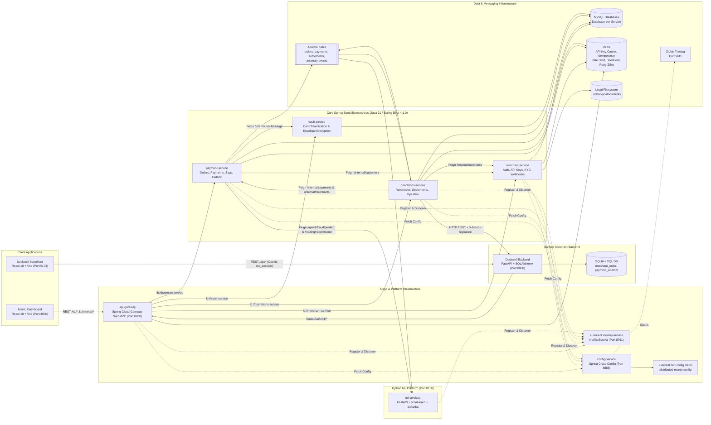

# High-Level System Architecture

```mermaid
flowchart LR
    subgraph Clients["Client Applications"]
        MUI["Mantu Dashboard<br/>React 18 + Vite (Port 3000)"]
        DUI["Deskwell Storefront<br/>React 18 + Vite (Port 5173)"]
    end

    subgraph SampleApp["Sample Merchant Backend"]
        DBK["Deskwell Backend<br/>FastAPI + SQLAlchemy (Port 8000)"]
        SDB[("SQLite / SQL DB<br/>merchant_order, payment_attempt")]
        DBK --> SDB
    end

    subgraph Edge["Edge & Platform Infrastructure"]
        GW["api-gateway<br/>Spring Cloud Gateway WebMVC (Port 8080)"]
        EUR["eureka-discovery-service<br/>Netflix Eureka (Port 8761)"]
        CFG["config-service<br/>Spring Cloud Config (Port 8888)"]
        GIT["External Git Config Repo<br/>distributed-mantu-config"]
        CFG --> GIT
    end

    subgraph Core["Core Spring Boot Microservices (Java 21 / Spring Boot 4.1.0)"]
        MS["merchant-service<br/>Auth, API Keys, KYC, Webhooks"]
        PS["payment-service<br/>Orders, Payments, Saga, Outbox"]
        VS["vault-service<br/>Card Tokenization & Envelope Encryption"]
        OS["operations-service<br/>Webhooks, Settlements, Ops Risk"]
    end

    subgraph ML["Python ML Platform (Port 8100)"]
        MLS["ml-services<br/>FastAPI + scikit-learn + aiokafka"]
    end

    subgraph DataInfra["Data & Messaging Infrastructure"]
        MYSQL[("MySQL Databases<br/>Database-per-Service")]
        REDIS[("Redis<br/>API Key Cache, Idempotency,<br/>Rate Limit, ShedLock, Retry ZSet")]
        KAFKA[["Apache Kafka<br/>orders, payments, settlements,<br/>anomaly events"]]
        FS[("Local Filesystem<br/>./data/kyc-documents")]
        ZIP["Zipkin Tracing<br/>Port 9411"]
    end

    MUI -- "REST /v1/* & /internal/*" --> GW
    DUI -- "REST /api/* (Cookie mc_session)" --> DBK
    DBK -- "Basic Auth /v1/*" --> GW
    OS -- "HTTP POST + X-Mantu-Signature" --> DBK

    GW -- "lb://merchant-service" --> MS
    GW -- "lb://payment-service" --> PS
    GW -- "lb://vault-service" --> VS
    GW -- "lb://operations-service" --> OS

    PS -- "Feign /internal/customers" --> MS
    PS -- "Feign /internal/vault/charge" --> VS
    PS -- "Feign /api/v1/fraud/predict & /routing/recommend" --> MLS
    OS -- "Feign /internal/payments & /internal/merchants" --> PS
    OS -- "Feign /internal/merchants" --> MS

    MS & PS & OS & VS --> MYSQL
    MS --> FS
    GW & MS & PS & OS --> REDIS
    PS & OS --> KAFKA
    KAFKA --> OS
    KAFKA --> MLS
    GW & MS & PS & OS & MLS -. "Register & Discover" .-> EUR
    GW & MS & PS & OS -. "Fetch Config" .-> CFG
    CFG -. "Spans" .-> ZIP
```
